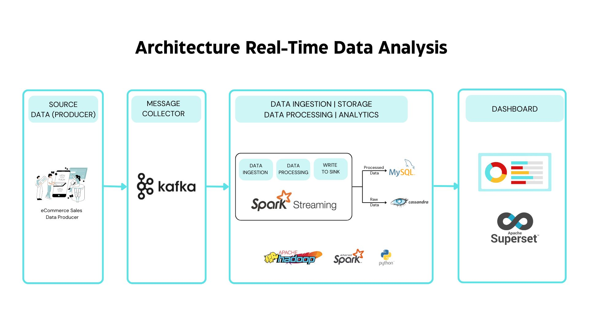

# Real-Time Data Analysis Pipeline

This project implements a real-time data analysis pipeline designed for processing and analyzing data from e-commerce platforms. The architecture leverages Apache Kafka for messaging, Apache Spark for data ingestion, processing, and analytics, and Apache Cassandra and MySQL for data storage. Superset is used for creating interactive dashboards to visualize the processed data. This pipeline provides end-to-end data flow from ingestion to visualization, supporting real-time decision-making and insights.

## Project Architecture

### 1. **Data Source Provider**
   - **Description**: Data is ingested from an e-commerce platform acting as the producer, which sends event data (e.g., sales, user interactions) to the pipeline.
   - **Purpose**: Acts as the primary data source, continuously generating events that need to be processed in real-time.

### 2. **Message Event Collaborator: Kafka**
   - **Description**: Apache Kafka is used for real-time messaging and event streaming. It acts as a broker, facilitating the smooth flow of data between the producer (e-commerce platform) and the processing engine (Spark).
   - **Purpose**: Ensures efficient and reliable data ingestion into the pipeline by decoupling data producers and consumers.

### 3. **Data Ingestion, Processing, and Analytics: Apache Spark Streaming**
   - **Description**: Apache Spark Streaming is employed for real-time data processing and analytics. It consumes data from Kafka, performs necessary transformations and analytics, and writes the results to the appropriate data sinks.
   - **Purpose**: To handle high-throughput data streams, perform real-time processing, and execute analytics tasks.

### 4. **Data Storage**
   - **Raw Data Storage: Apache Cassandra**
     - **Description**: Apache Cassandra stores raw, unstructured data as it is ingested into the system. Cassandra's NoSQL architecture supports high availability and scalability, making it suitable for storing vast amounts of real-time data.
     - **Purpose**: Provides a fault-tolerant, distributed storage solution for raw data, enabling quick retrieval for further processing.
   
   - **Structured Data Storage: MySQL**
     - **Description**: Processed and structured data is saved into MySQL, a relational database, which allows for more complex queries and aggregations.
     - **Purpose**: Facilitates the storage of clean, structured data for analysis and reporting, ensuring easy access for dashboarding and visualization tools.

### 5. **Dashboarding: Superset**
   - **Description**: Apache Superset is used for creating dashboards and visualizations of the processed data. It connects to the MySQL database, providing an intuitive interface for exploring and visualizing data in real-time.
   - **Purpose**: Enables stakeholders to interact with data through customizable dashboards, supporting data-driven decisions with real-time insights.

## Data Flow Overview

1. **Data Generation**: E-commerce platform acts as a data producer, generating real-time event data.
2. **Event Messaging**: Kafka receives and manages the event stream, distributing it to the Spark Streaming engine.
3. **Data Processing**: Spark Streaming processes the incoming data, performing necessary transformations and analytics.
4. **Data Storage**:
   - Raw data is saved in Apache Cassandra for high-speed, unstructured data storage.
   - Processed data is written to MySQL for structured storage, supporting advanced querying and reporting.
5. **Visualization**: Superset connects to MySQL, providing an interface for real-time dashboards and analytics.

## Key Technologies

- **Apache Kafka**: Real-time event streaming and message brokering.
- **Apache Spark Streaming**: Real-time data processing and analytics.
- **Apache Cassandra**: NoSQL database for raw data storage.
- **MySQL**: Relational database for processed, structured data storage.
- **Apache Superset**: Data visualization and dashboarding tool.

## Architecture:


## Getting Started

1. **Clone the Repository**:
   ```bash
   git clone https://github.com/yourusername/real-time-data-analysis-pipeline.git
   ```
   
2. **Set Up Kafka**: Install and configure Kafka to handle message streaming from the data producer.
   
3. **Configure Spark Streaming**: Set up Apache Spark to connect with Kafka, Cassandra, and MySQL for processing and data storage.

4. **Database Setup**:
   - **Cassandra**: Set up keyspaces and tables for raw data.
   - **MySQL**: Define schemas for structured data storage.
   
5. **Deploy Superset**: Install and configure Superset to connect with MySQL for real-time data visualization.

## Usage

- **Run Kafka**: Start Kafka brokers to begin receiving data from the e-commerce data source.
- **Start Spark Streaming**: Execute the Spark Streaming job to process incoming data from Kafka.
- **View Dashboards**: Use Superset to explore and interact with the processed data, available in the form of interactive dashboards.

## Future Improvements

- Integration with additional data sources.
- Implementation of advanced analytics and machine learning models within the Spark pipeline.
- Enhancements in data visualization and dashboard interactivity.
